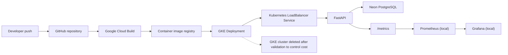
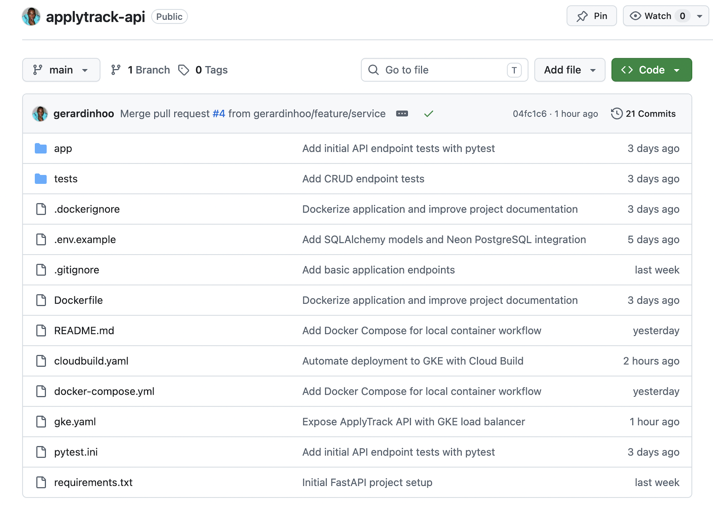
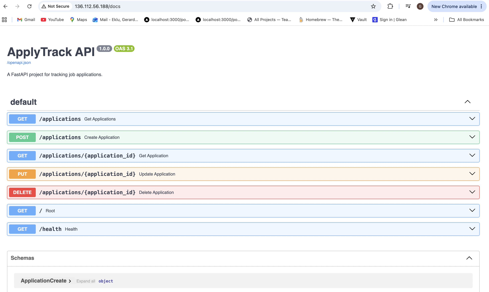
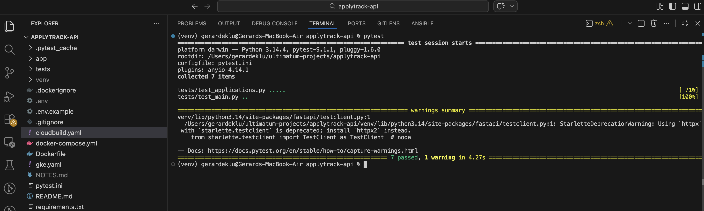
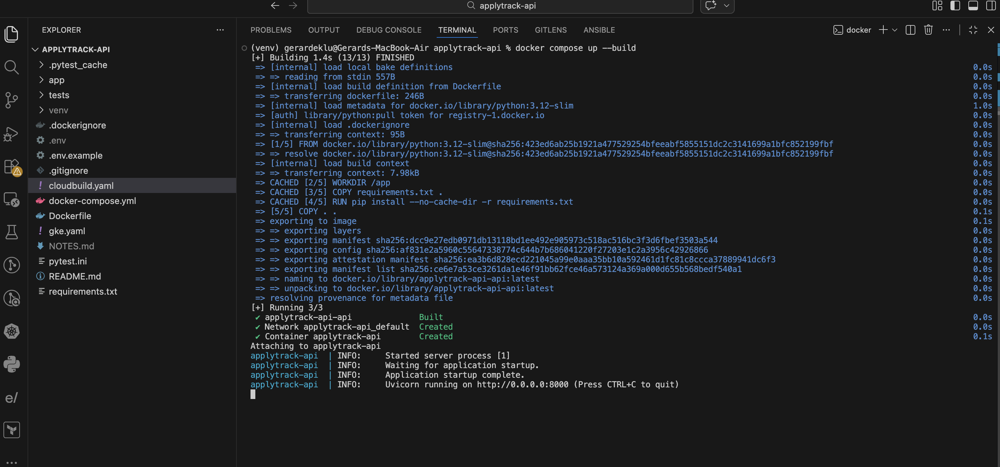
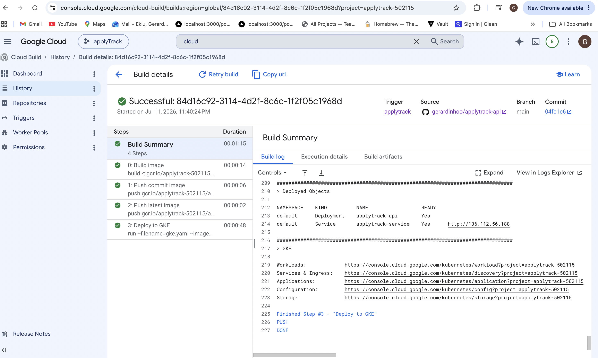
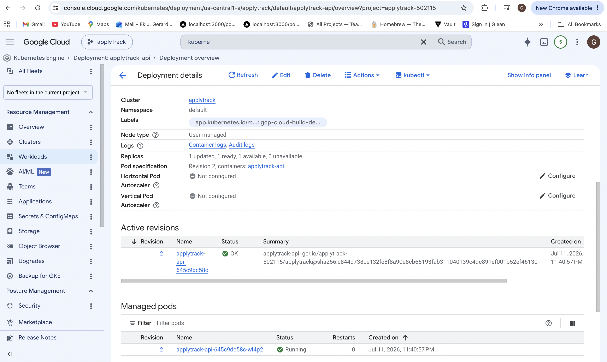
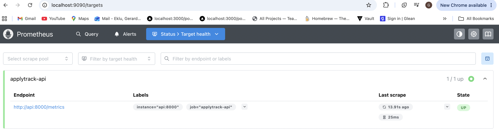
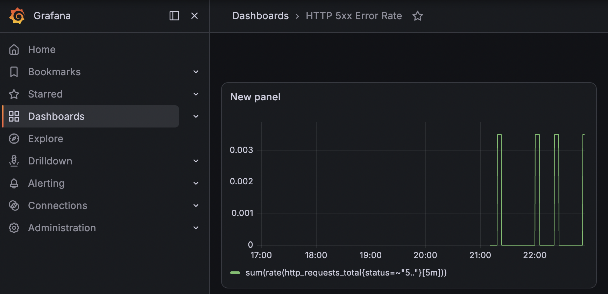

# ApplyTrack API

ApplyTrack is a FastAPI service for tracking job applications and a hands-on reliability lab. It brings together backend engineering, automated testing, containerization, CI/CD, cloud deployment, Kubernetes, and application observability in one reproducible portfolio project.

## Project Overview

The API stores job applications with a company, position, and status, and provides REST endpoints to create, read, update, and delete them. Data is persisted in PostgreSQL through SQLAlchemy, with Pydantic validating incoming requests.

ApplyTrack began as a focused CRUD API and evolved into a reliability-oriented project: the service was containerized, deployed to Google Kubernetes Engine (GKE) through Google Cloud Build, instrumented for Prometheus, visualized in Grafana, and exercised with a controlled failure scenario. It is a practical lab rather than a claim of large-scale production operation.

## Key Features

- CRUD REST API with Pydantic request validation
- SQLAlchemy ORM with PostgreSQL persistence hosted on Neon
- Seven automated API tests with pytest
- Docker image and Docker Compose local workflow
- Google Cloud Build CI/CD with immutable commit-SHA image tags
- Validated GKE deployment with a Kubernetes Deployment and LoadBalancer Service
- Kubernetes liveness and readiness probes, resource requests and limits, and Secret-based `DATABASE_URL` injection
- Prometheus-compatible metrics exposed at `/metrics`
- Grafana panels for traffic, latency, and HTTP 5xx errors
- Documented SLIs, SLOs, and error budget
- Environment-controlled failure simulation and sample incident documentation

## Tech Stack

| Category | Technologies |
| --- | --- |
| Backend | Python, FastAPI, Uvicorn, Pydantic, SQLAlchemy |
| Database | PostgreSQL, Neon |
| Testing | pytest, FastAPI TestClient |
| Containers | Docker, Docker Compose |
| Cloud and CI/CD | Google Cloud Build, Container Registry, Google Cloud |
| Kubernetes | GKE, Deployment, LoadBalancer Service, probes, resources, Secrets |
| Observability | Prometheus, Grafana, `prometheus-fastapi-instrumentator`, PromQL |

## Architecture



The GKE path was deployed and tested successfully. The cluster was later deleted, so the diagram describes the validated deployment architecture rather than a currently live public service.

## API Endpoints

| Method | Endpoint | Description |
| --- | --- | --- |
| `GET` | `/` | Return the API status message |
| `GET` | `/health` | Return the health status used by Kubernetes probes |
| `GET` | `/applications` | List all job applications |
| `POST` | `/applications` | Create a job application |
| `GET` | `/applications/{application_id}` | Retrieve one job application |
| `PUT` | `/applications/{application_id}` | Replace an existing job application's fields |
| `DELETE` | `/applications/{application_id}` | Delete a job application |
| `GET` | `/metrics` | Expose Prometheus-compatible application metrics |

### Optional test endpoint

`GET /test-error` intentionally returns HTTP 500 only when `ENABLE_TEST_ENDPOINTS=true`. When the setting is absent or false, the route returns HTTP 404. Keep it disabled outside controlled local monitoring tests.

## Running Locally

A PostgreSQL database is required. Create a local `.env` file containing a valid connection string:

```env
DATABASE_URL=your_postgresql_connection_string
```

Add `ENABLE_TEST_ENDPOINTS=true` only when running the controlled failure exercise locally. Do not commit the `.env` file.

### Python virtual environment

```bash
python -m venv venv
source venv/bin/activate
pip install -r requirements.txt
uvicorn app.main:app --reload
```

On Windows PowerShell, activate the environment with `venv\Scripts\Activate.ps1`.

### Docker

```bash
docker build -t applytrack-api .
docker run --env-file .env -p 8000:8000 applytrack-api
```

### Docker Compose

Docker Compose starts the API, Prometheus, and Grafana:

```bash
docker compose up --build
```

- API: <http://localhost:8000>
- Swagger UI: <http://localhost:8000/docs>
- Metrics: <http://localhost:8000/metrics>
- Prometheus: <http://localhost:9090>
- Grafana: <http://localhost:3000>

## Testing

Run the test suite with a test-accessible `DATABASE_URL` configured:

```bash
pytest
```

The current suite contains seven tests covering the root and health routes plus create, list, retrieve, update, and delete application behavior. This describes the tested behaviors and does not claim full code coverage.

## Reliability Objectives

The detailed [SLI, SLO, and error-budget definitions](docs/slos.md) cover three indicators:

- Availability: the ratio of valid requests that do not return HTTP 5xx, with a 99% SLO over a rolling 30-day window
- Latency: p95 request latency, with a target that at least 95% of requests complete in under 500 ms
- Server errors: the HTTP 5xx response ratio, with a target below 1%

An **SLI** is the measured signal, an **SLO** is its target, and an **error budget** is the tolerated unreliability implied by that target. ApplyTrack does not receive continuous production traffic, so these are explicit reliability objectives and learning targets rather than claims based on ongoing production measurements.

## Observability

FastAPI exposes Prometheus-compatible metrics at `/metrics`. In the local Compose environment, Prometheus scrapes the API every 15 seconds and Grafana reads the collected time series from Prometheus. The instrumentation library normalizes route labels to templates such as `/applications/{application_id}`, which avoids separate labels for every resource ID.

The monitored signals cover traffic, latency, and errors. The Grafana work includes these panels:

- Total HTTP Requests
- Request Rate
- p95 Request Latency
- HTTP 5xx Error Rate

Kubernetes saturation monitoring was outside the scope of this implementation.

## Failure Simulation

The environment-controlled `/test-error` route was used to generate known HTTP 500 responses. During the exercise, the total-request, request-rate, latency, and 5xx panels reacted to the generated traffic. After the test stopped, the monitored error rate returned to its normal state.

This was a controlled failure simulation used for observability validation and incident-response practice, not full chaos engineering. See the [sample incident report](docs/sample-incident.md) for the recorded detection, impact, resolution, and lessons.

## Deployment and CI/CD

The implemented delivery flow is:

```text
GitHub push
  -> Cloud Build trigger
  -> Docker image build
  -> commit SHA and latest tags
  -> image push
  -> deployment to GKE
```

[`cloudbuild.yaml`](cloudbuild.yaml) builds and pushes both an immutable `$SHORT_SHA` image and a convenience `latest` tag, then deploys the commit-specific image. [`gke.yaml`](gke.yaml) defines the one-replica Deployment, health probes, compute resources, Secret reference, and LoadBalancer Service.

The pipeline and application were successfully tested on GKE. The cluster was subsequently deleted to control cloud costs, so no live public endpoint is advertised. The Cloud Build trigger may remain disabled while the target cluster does not exist.

## Screenshots

### API and project

Repository and project files:



Swagger UI with the CRUD endpoints:



### Testing and local containers

Seven passing pytest tests:



Docker Compose building and starting the local service:



### CI/CD and GKE

Successful Cloud Build pipeline and GKE deployment step:



Validated GKE workload with a ready replica:



### Prometheus and Grafana

Prometheus reporting the local API target as up:



Grafana showing HTTP 5xx activity during the controlled failure simulation:



## Repository Structure

```text
applytrack-api/
├── app/                  # FastAPI application, models, schemas, and routes
├── tests/                # API tests
├── docs/                 # Reliability objectives and sample incident
├── monitoring/           # Prometheus scrape configuration
├── Dockerfile
├── docker-compose.yml
├── cloudbuild.yaml
├── gke.yaml
└── README.md
```

## Lessons Learned

- Structuring FastAPI routes and validating request data with Pydantic
- Persisting CRUD data through SQLAlchemy and PostgreSQL
- Exercising API behavior with automated pytest tests
- Building a repeatable local workflow with Docker and Docker Compose
- Building and deploying immutable images through Cloud Build and GKE
- Configuring Kubernetes health probes, resource boundaries, Services, and Secrets
- Defining user-focused SLIs, SLOs, and an error budget
- Instrumenting FastAPI for Prometheus and building Grafana panels
- Applying PromQL counters, rates, and histogram quantiles to traffic, errors, and p95 latency
- Validating monitoring behavior with a controlled failure and documenting the incident

## Cost-Conscious Cleanup

After deployment validation, the GKE cluster and its compute and load-balancer resources were deleted to avoid ongoing charges. The source code, Kubernetes manifests, Cloud Build configuration, documentation, screenshots, and container registry history can remain as reproducible evidence of the implementation.

## Portfolio Positioning

ApplyTrack demonstrates an end-to-end workflow across backend development, database persistence, testing, containerization, CI/CD, Kubernetes, cloud deployment, reliability objectives, observability, and controlled incident simulation. Its scope is intentionally presented as a hands-on service and reliability lab rather than a large-scale production system.
